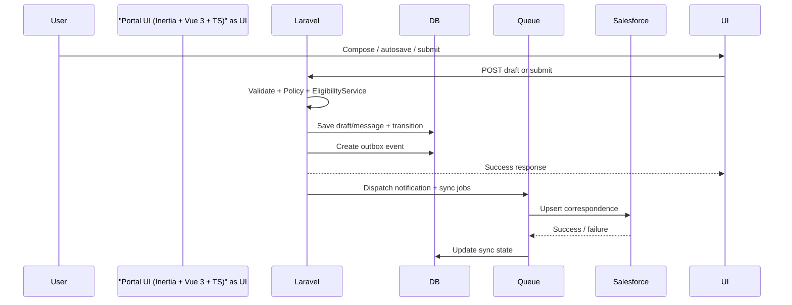
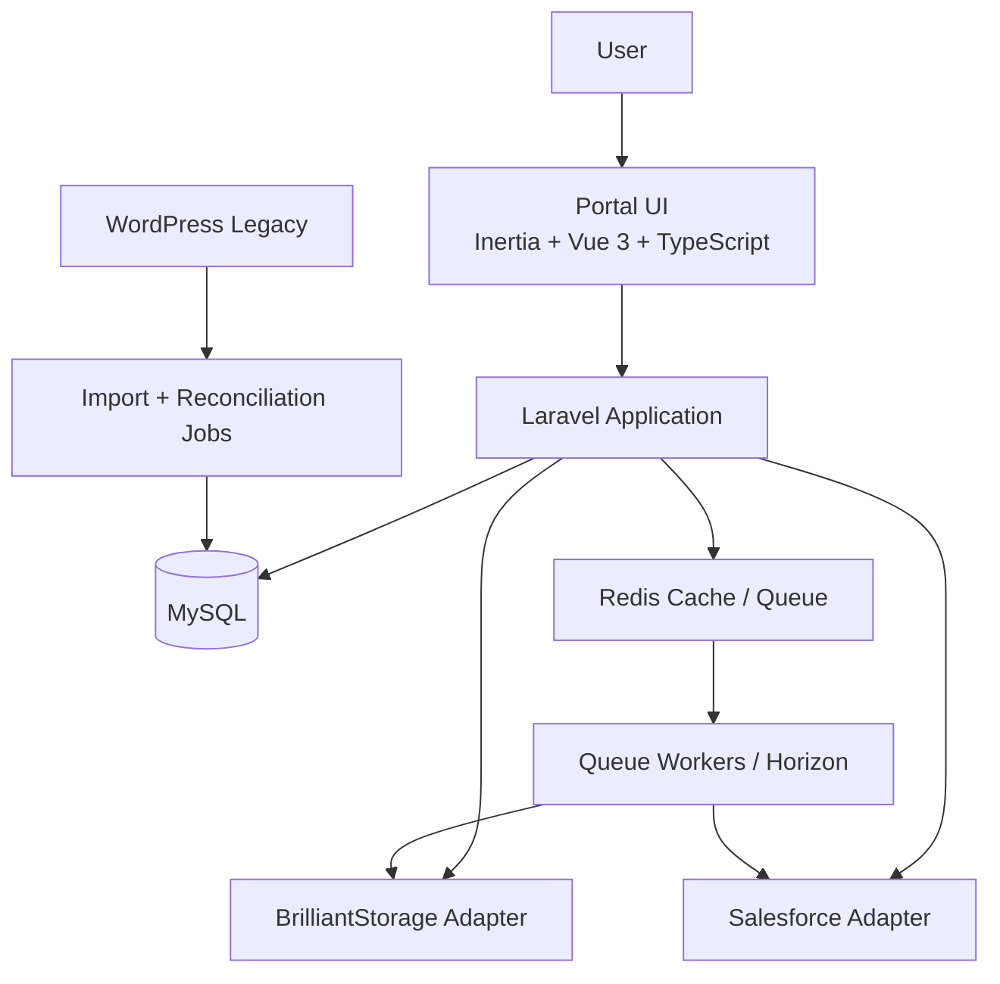

# ✅ 1. Sequence Diagram (your main flow)

```mermaid
sequenceDiagram
    participant User
    participant "Portal UI (Inertia + Vue 3 + TS)" as UI
    participant Laravel
    participant DB
    participant Queue
    participant Salesforce

    User->>UI: Compose / autosave / submit
    UI->>Laravel: POST draft or submit
    Laravel->>Laravel: Validate + Policy + EligibilityService
    Laravel->>DB: Save draft/message + transition
    Laravel->>DB: Create outbox event
    Laravel-->>UI: Success response
    Laravel->>Queue: Dispatch notification + sync jobs
    Queue->>Salesforce: Upsert correspondence
    Salesforce-->>Queue: Success / failure
    Queue->>DB: Update sync state
```

---

# ✅ 2. System Architecture (cleaned version)

```mermaid
graph TD

    User --> UI[Portal UI<br/>Inertia + Vue 3 + TypeScript]
    UI --> Laravel[Laravel Application]

    Laravel --> DB[(MySQL)]
    Laravel --> Redis[Redis Cache / Queue]

    Redis --> Workers[Queue Workers / Horizon]

    Laravel --> Storage[BrilliantStorage Adapter]
    Workers --> Storage

    Laravel --> Salesforce[Salesforce Adapter]
    Workers --> Salesforce

    WordPress[WordPress Legacy] --> Jobs[Import + Reconciliation Jobs]
    Jobs --> DB
```
